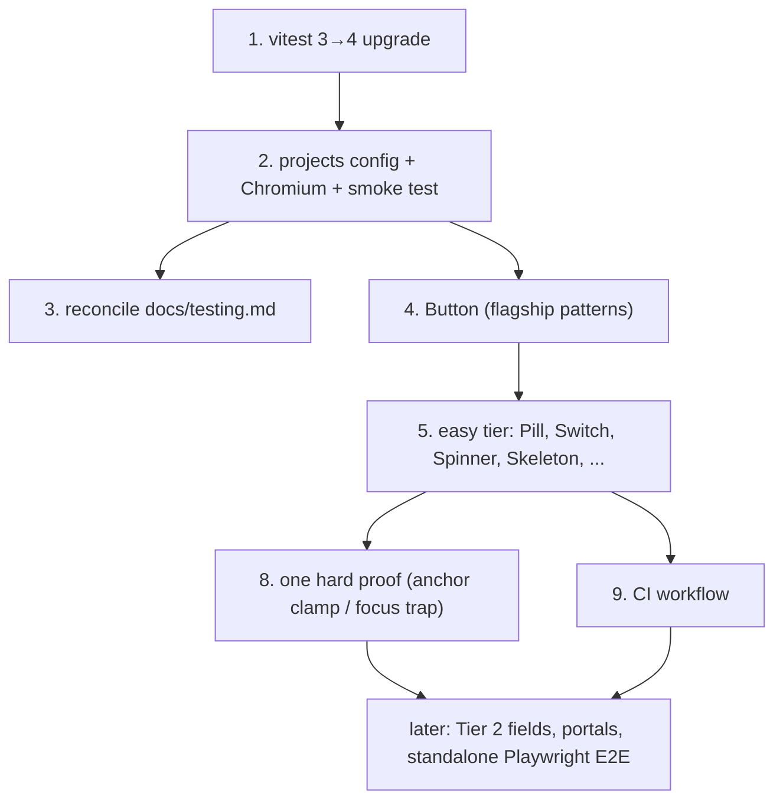

<!--
GENERATED ANALYSIS — @marianmeres/stuic real-browser component testing
Produced 2026-06-08 by multi-agent research → adversarial verify → synthesize.
Claims verified against the codebase at commit cc9958b and the live Vitest 4 /
vitest-browser-svelte docs. Planning artifact; no code was changed.
-->

# @marianmeres/stuic — Component Testing: Overview & Roadmap

> **Verdict:** the proposed stack — Vitest Browser Mode + `vitest-browser-svelte` + Playwright/Chromium
> — is the right default for *this* library, where the value being shipped is precisely the DOM/layout/
> focus/positioning behavior that the current node/server-build test setup **cannot exercise at all**.
> The claim is *mostly* correct rather than gospel: it's not an officially-mandated singular standard
> (svelte.dev still nominally leads with jsdom + @testing-library), and one term was dated — modern
> spelling is `vitest-browser-svelte` + **`@vitest/browser-playwright`** + `playwright` on **Vitest 4**.
>
> **The one thing that matters most:** a **vitest 3 → 4 major upgrade is a hard prerequisite**
> (`vitest-browser-svelte@^2` peer-requires `vitest ^4`; Browser Mode is only stable in v4). Do it as
> a discrete, reversible first commit and confirm the 9 existing suites stay green before anything else.
>
> **The second thing:** route tests by filename into a Vitest `projects` split — `*.test.ts` → fast
> **node** (the existing 9 suites, untouched), `*.svelte.test.ts` → real **browser**. Get that glob
> right and nothing regresses; get it wrong and either utils crawl in a browser or components fail in
> node with the very server-build error this effort exists to escape.
>
> Read order: this file → [`01-framework-setup`](./01-framework-setup.md) for the exact config →
> [`02-test-conventions`](./02-test-conventions.md) for how to write a test → then work
> [`PROGRESS.md`](./PROGRESS.md) top-down. [`03`](./03-component-coverage-roadmap.md) ranks all 74
> components; [`04`](./04-hard-cases-and-e2e.md) handles the hard 30; [`05`](./05-ci.md) is CI.

## A note on `docs/testing.md` (this is a partial reversal — by design)

[`docs/testing.md`](../testing.md) records a deliberate decision **not** to test component rendering
("50+ components × prop combos = slow suite, tiny yield; rendering is gated by svelte-check + publint +
build"). That reasoning holds for *"does it render"* and we keep it. What changes: browser mode lets
us test *"does it **behave**"* — events, two-way binding, aria/disabled/active state, focus traps,
viewport-clamped positioning (cf. the `9d8c974` annotation regression) — which the build does **not**
cover and which was **previously impossible**. Updating `docs/testing.md` to add this layer is an
explicit sprint task so the docs don't contradict each other.

## Top recommendations across all dimensions (ranked)

| Rank | Recommendation | Dimension | Value | Effort | Risk | Why now |
|------|----------------|-----------|-------|--------|------|---------|
| 1 | Upgrade vitest 3→4, verify 9 suites green | [01](./01-framework-setup.md) | high | S | med | Gating prerequisite; nothing installs without it |
| 2 | Add `projects` split (node `server` + browser `client`) + Chromium | [01](./01-framework-setup.md) | high | S | med | The harness; routes by `*.svelte.test.ts` filename |
| 3 | Separator smoke test — prove client build + `$effect` actually run | [01](./01-framework-setup.md) | high | S | med | Disproves/confirms the documented server-build blocker |
| 4 | Reconcile `docs/testing.md` (behavior ✅, rendering still ❌) | [02](./02-test-conventions.md) | med | S | low | Keep docs internally consistent before scaling |
| 5 | Button — flagship; sets every assertion pattern | [03](./03-component-coverage-roadmap.md) | high | S | low | Most-used primitive; template for the rest |
| 6 | Pill, Switch — events + binding patterns | [03](./03-component-coverage-roadmap.md) | high | S | low | Cover dismiss/toggle/bind once, reuse everywhere |
| 7 | Spinner, Skeleton, DismissibleMessage, Avatar, Progress | [03](./03-component-coverage-roadmap.md) | high | S | low | Deterministic, high-traffic; quick wins |
| 8 | **One hard proof** — anchor-position viewport clamp (or focus trap) | [04](./04-hard-cases-and-e2e.md) | high | M | med | Guards a real recent regression; proves browser mode's worth |
| 9 | Minimal GitHub Actions workflow | [05](./05-ci.md) | high | S | low | Stops broken tests reaching npm; once a few tests pass |
| 10 | Tier-2 form fields (`FieldInput` first, then the family) | [03](./03-component-coverage-roadmap.md) | med | M | low | Largest component group; one pattern unlocks many |
| 11 | Portals/focus-traps in browser mode (Modal/Drawer/Backdrop) | [04](./04-hard-cases-and-e2e.md) | med | M | med | High-value a11y contracts; after patterns settle |
| 12 | Standalone Playwright E2E layer (drag, Milkdown, checkout flows) | [04](./04-hard-cases-and-e2e.md) | med | L | med | Separate later initiative; explicitly out of sprint 1 |

> **Deliberately deferred as low-yield:** visual-regression / `toMatchScreenshot`, multi-browser
> (Firefox/WebKit) matrix, and exhaustive prop-matrix coverage. Revisit only if motivated by a real bug.

## Recommended first sprint (do these first)

Branch: `feat/component-testing`. One commit per task.

1. **Vitest 4 upgrade (#1)** — `pnpm add -D vitest@^4`, run `pnpm test`, confirm 9 suites green. Why
   first: everything else peer-depends on it; isolating it makes the one risky bump reversible.
2. **Browser harness (#2, #3)** — add browser deps, the `projects` config, `playwright install
   chromium`, fix the test scripts, and land the Separator smoke test. Unblocks all component tests
   and proves the server-build blocker is gone. Detail in [01](./01-framework-setup.md).
3. **Reconcile `docs/testing.md` (#4)** — small doc edit so the philosophy matches reality.
4. **Button (#5)** — establishes the assertion vocabulary ([02](./02-test-conventions.md)) every later
   test reuses. Highest-leverage single component.
5. **Pill → Switch → Spinner → Skeleton → DismissibleMessage → Avatar → Progress (#6, #7)** — the easy
   tier, one commit each; fast, deterministic, high-traffic coverage.
6. **One hard proof (#8)** — anchor-position viewport clamp (recommended) or focus trap; the payoff
   moment that justifies the whole setup. Detail in [04](./04-hard-cases-and-e2e.md).
7. **CI (#9)** — the ~30-line workflow, now that there's a real suite to run. Detail in [05](./05-ci.md).

## Cross-cutting themes

- **Filename routing is load-bearing.** The `*.svelte.test.ts` vs `*.test.ts` convention is what keeps
  node fast and browser correct. It appears in every dimension.
- **Test behavior, not rendering.** The build already proves components render; tests exist for the
  contracts it can't see (events, binding, aria, geometry). This both reconciles `docs/testing.md` and
  picks the high-yield targets.
- **Extract-then-unit-test stays valid.** Pure logic in `_internal/*.ts` (drop math, cron parsing,
  clamp math) should keep getting fast node tests; browser mode is additive, not a replacement.
- **One commit per component** keeps the effort resumable and reviewable, exactly matching the
  PROGRESS.md convention.

## Dependency / sequencing notes

## Completeness check

- **Snippet-heavy components** (Button needs `children`): the `createRawSnippet` pattern is settled in
  [02](./02-test-conventions.md); first real exercise is Button — watch for friction and codify a shared
  helper home then.
- **SvelteKit-plugin-in-browser-mode** is the top unknown; the Separator smoke test (task 2) is the
  designated early canary, with a documented fallback (plain `svelte()` plugin for the client project).
- **`packageManager` field is absent** — surfaces in CI ([05](./05-ci.md)); resolve when writing the
  workflow.
- Not yet scoped: a dedicated `playwright.config.ts` for the standalone E2E layer — intentionally
  deferred to its own future initiative ([04](./04-hard-cases-and-e2e.md)).

Source documents: [`01-framework-setup`](./01-framework-setup.md), [`02-test-conventions`](./02-test-conventions.md),
[`03-component-coverage-roadmap`](./03-component-coverage-roadmap.md), [`04-hard-cases-and-e2e`](./04-hard-cases-and-e2e.md),
[`05-ci`](./05-ci.md).
